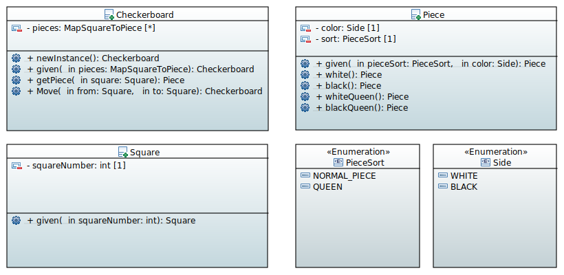

= Checkerboard class diagram

This class diagram demonstrates the interactions between CheckerBoard, Side, Square, PieceSort and Piece classes (Side and PieceSort are of type *enum*).

= Explanation of the class diagram

*Checkerboard*

* An instance variable *pieces* of type `MapSquareToPiece`  allows to model the position of the pieces on the checkerboard. For example, a piece on the square A1 will be represented by ' Square object : Piece object '.

* `given` is a static factory method. We use it to create a board for which we know the position of the pieces. This method is useful for loading a game already started and restoring checkerboard's state. 

* `doMove` is useful to simulate the movement of a piece associated with given *squares*. 

* `getPiece` allows to find out the *piece* located on a given square.

*Piece*

* `white` (resp. `black`) is the static factory method representing a piece of the white color (resp. black).

* `whiteQueen` (resp. `blackQueen`) is the static factory method representing a *Queen* piece of the white color (resp. blackQueen`).

*Square*

* `given` allows to create a *square* given the rank (row) and file (column).

=  Diagram

