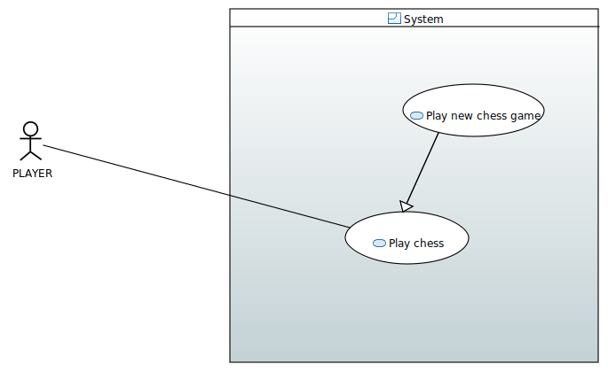
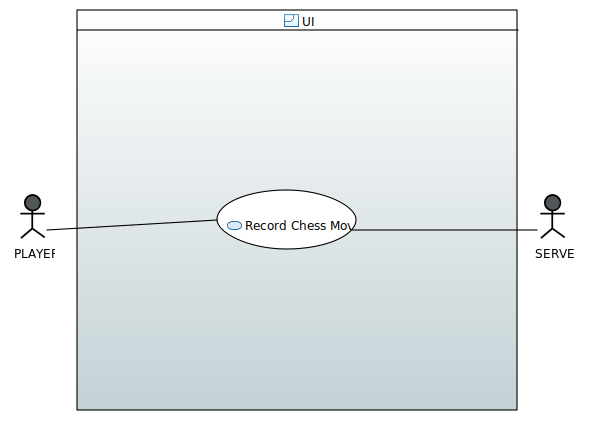
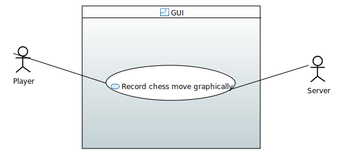

== Play Chess Diagram:

The use case diagram https://github.com/oliviercailloux-org/projet-assisted-board-games-1/blob/ABG-2/Doc/Diagrams/Play_chess.SVG[Play chess] contains two use cases `Play chess` and `Play new chess game` and an actor: the player. This use case will be our main focus at first, meaning that we will need to have a server to record the moves previously played.
Complete use case diagram is: 

== Record Chess Move Diagram:

The Use Case Diagram Record Chess Move contains the two same actors mentioned above, linked to a Use Case Record Chess Move.
In this situation, the player have to play before the system records the chess move. After the system recorded the movement, it will update the position and recover the updates from the opposite player. We didn't add all the details in the Use Case Diagram because it was too heavy.
This Use Case will be our short term main focus.

Complete Use Case Diagram: 

== Record Chess Move Graphically Diagram:

The use case diagram Record Chess Move Graphically contains 2 actors, the player and the server. This Use Case describe the movement of a piece by the player.
When the player select a chess piece, it will display all the possible moves. Then, the player can change the piece position.
After the play, the recording of the new position by the server will be done. The server can also recover the moves.
This Use Case needs to be created first to be connected by the Use Case 1

Complete Use Case Diagram: 

