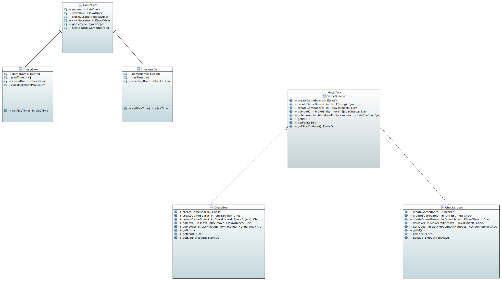

= Generalization

This project iteration aims to generalize the existing code and make it reusable to other type of board games. For now, there is only one proposed board game: chess. Our long term goal is to also add another board game: Checkers (Draughts).
For this reason, the created diagramm proposes changes that could be made to existing classes and additions, which could be introduced. To give an example, it tries to improve the way *GameEntity* class handles Chess game to be able to reuse existing aspects which are common to both games.

== Diagramm description
Since there are many similarities, as well as differences between two games, we are decided that *ChessGame* and *CheckersGame* classes could inherit some of the useful properties of the GameEntity class and implement the parts which are very specific to one game in their respective classes.

We've also decided to introduce a new _Interface_ called *GameBoard*, which imposes certain contracts that the classes for these two and maybe future games will need to implement. This way, we can guarantee that the basic functionality is provided, but it's up to the classes to how exactly implement those functionalities.

*GameBoard* _Interface_ is _generic_. The reason why we've decided to make it generic is because *createGameBoard()*, *doMove()* and *doMoves* methods should return a specific type of a Game Board, since Interface's methods should be implement exactly as they are described in the Interface, it would create a certain problem, for example for *CheckerBoard* if the return type of the implemented methods were *ChessBoard*, that's why we need Generics.

With that being said it's not 100% working solution and doesn't describe the exact state of the final version of the application, more improvements should be added/modified later on which coding new functionalities or modifying the existing codebase.

*Binôme*:
|===
|Developer 1 |Developer 2

|Kerim HUDAYBERDIYEV
|Anam SHAIKH YUNUS
|===

== Papyrus diagramm:
