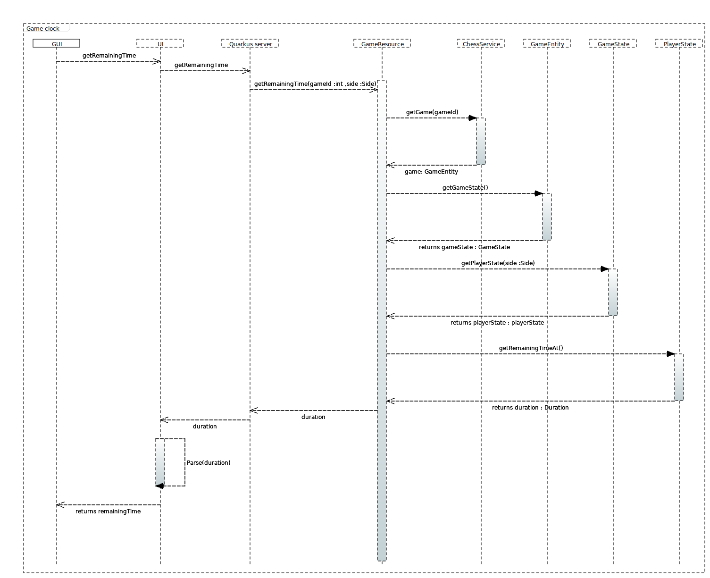

= Documentation for display of a game clock.

Our goal was to display a remaining time for both player when they play Chess. For this purpose, new JavaScript function was added, which sends get requests to server to get the correct value of the remaining time (for both players).

Obtained response from the server is parsed to obtain *hours*, *minutes* and *seconds*, so we could display it in a pretty format like this *00:00:00*, instead of just displaying the original value which server returns, e.g.: *PT30M*, it's done for convenience of players. The value of the parsed time is then stored in each players' time objects, which handle the computation of the remaining time.

Every seconds a dedicated function is called on a client-side to update the remaining time for an active player.

Additional *HTML* elements and *styles* were added to display the remaining time, which JavaScript code interacts with.

= Changing the default clock duration

After displaying the remaining time for white and black players, more functionalites were added for letting the players change the default clock duration and increment time, since it's essential to give players such kind of possibility, because the duration of a *casual* chess game differes a *LOT* from the duration of a *competitive* chess game.

For this, *Java* method named *createGame* was modified which responds to *POST* requests, uses the request parameters to change the default clock duration and increment by creating a new *GameEntity* object and calling it's constructor which permits to define clock duration and increment value.

The values of these parameters are obtain from a *player* after they enter it into the *input* field and hit the *confirm* button. Worth noting that the button gets disabled after clicking *New game* button, since the values are only used to create a new game.

If the player changes clock duration and increment time, new values would be displayed and confirmation *button* with an input *fields* get disabled.

Demonstration:

image::Images/Demo.gif[demonstation,1000,700]

= Some additional elements on the functioning of the clock system.

The Class GameEntity contains the attributes `startTime`, `clockDuration` and `clockIncrement`.
the `clockDuration` is the total time of the game planned for each player (in black and white side).
 the `clockIncrement` corresponds to the additional time added to the `clockDuration` after each move played by a player (if the player has 2min30 left with a `clockIncrement` of 10 sec, at the next move of the player his `clockDuration` becomes 2min40).

Two constructors are present in `GameEntity` , the first one in case values are given for the `startTime` , the `clockDuration` and the `clockIncrement`.

The second constructor, in the case where the clock informations are not given, initializes by default the `clockDuration` value to 30 minutes (1800 seconds) and the `clockIncrement` value to 10 seconds. In this case, the value of `startTime` can be filled in later via the method `setStartTime()`

The server must get the remaining time continuously to display it to the player. The javascript interface calls the server in the `GameResource` calss at the following addresses `{gameId}/clock/white` for the whites and `{gameId}/clock/black` for the blacks. The methods `getWhiteRemainingTime()` and `getBlackRemainingTime()` get the `GameEntity` thanks to the `gameId` sent by the interface.

From this `GameEntity` instance, the `GameState` of the game is also retrieved by calling the `getGameState()` method. finally, we call the `getPlayerState()` method to retrieve the `PlayerState` of the corresponding side (black or white). It is from the instance of the `PlayerState` class that the remaining time can be obtained using the `getRemainingTime()` method.

It is possible to retrieve a history of the player states for a given game using `getPlayerStates()`. This method allows to represent a kind of history of the player's state as a succession of `PlayerState`. To be able to manage the information relative to the clock it is necessary to know when each player instance of the `PlayerState` class started his turn (`timeAtTurnStart`) as well as the (`RemainingTime`) before the end of his allocated time.

For each move played, we subtract from the `RemainingTime` of the side that played the move the duration between the beginning of the turn of the given side and the moment when the move was played. `move.getDuration()` allows to retrieve this duration, each move played has a duration value defined at the construction of an instance of `MoveEntity`. the duration is 0 in case no `Duration` is specified at the instantiation of this class. it's this duration that is subtracted from the current `RemainingTime` of the player that played the move.

Then is added to the `RemainingTime` of the same side, the value of the `clockIncrement` (default value or value specified by the player).
 
Once the `RemainingTime` of one of the players passes 00:00:00, the method `hasLostByTime()` is called and the player whose time has passed has lost.

= Source

Resources which were used during the implementation:

JavaScript GET Request:: https://stackoverflow.com/questions/247483/http-get-request-in-javascript
JavaScript POST Request:: https://stackoverflow.com/questions/9713058/send-post-data-using-xmlhttprequest
