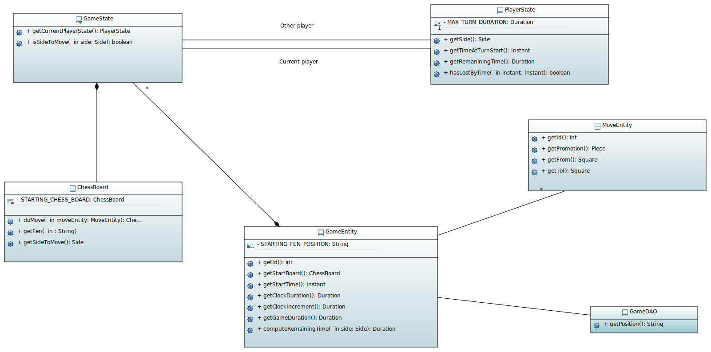

=== Explanation of the class diagram:

* `GameEntity` : The GameEntity class initializes the game of chess by setting up a clock for each player. It allows to define a time constraint for a game. 

*  `PlayerState` : manages all the information about the remaining time of the player, if he lost because he exceeded the time limit, his side (white or black).

* `GameState` : manages all the information about the state of the game at a given time. It manages the state of the board, i.e. how each piece is placed on the board. The class contains two `PlayerState` (one whose turn it is to play and one whose turn it is not).

* `ChessBoard` : create the chess board with all the pieces loaded.

* `MoveEntity` : manage the moves of the pieces on the board.

* `GameDAO` : get the position of a piece on the board. 

_You have below an image showing the class diagram:_

