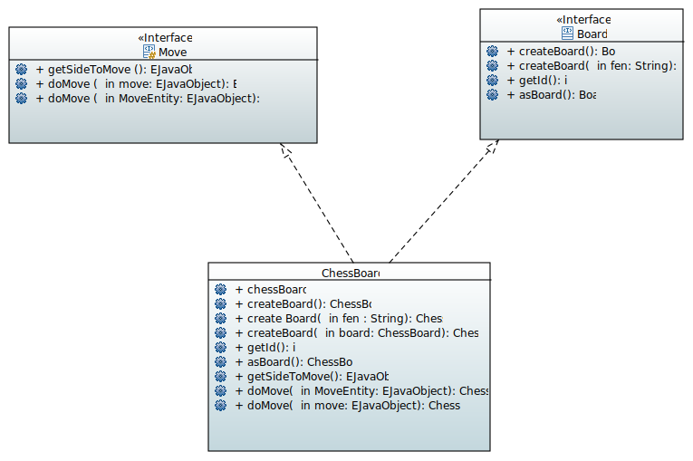

== Generalization
This project iteration aims to generalize the existing code and make it reusable to other type of board games. For now, there is only one proposed board game: chess. Our long term goal is to also add another board game: Checkers (Draughts). For this reason, the created diagramm proposes changes that could be made to existing classes and additions, which could be introduced. To give an example, it tries to improve the way GameEntity class handles Chess game to be able to reuse existing aspects which are common to both games.

== Diagramm description
We decided to create two interfaces: Move and Board, with implementations each (for chess and checkers). Also, we chose to replace the list with multiplicities. Indeed, this is what the professor suggested we do during the last iteration. Finally, we took the advice to focus on changing the game of chess for the next iteration, and see the game of checkers later.  Our application will manage several games (at least two, chess and card games). Because these games are different, everyone needs specific classes to define (both to ensure their movements and to generate their board).

== Papyrus diagramm:

