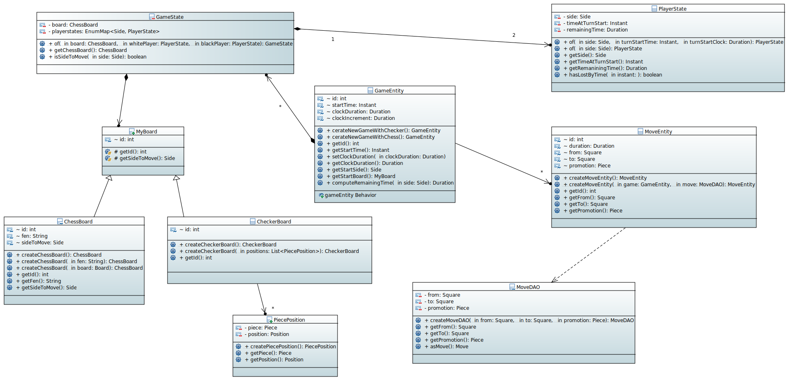

=== Overview of the class diagram:

This diagram represent a new set of generic classes which allows us to generalize our approach of games

=== class diagram:

_You have below an image showing the class diagram:_
Link to the diagram: https://github.com/oliviercailloux-org/projet-assisted-board-games-1/blob/main/Doc/Diagrams/GeneralizeGames.svg[Here]

=== Explanation of the class diagram:

* `MyBoard` : Myboard is an abstract class, it serves as an inheritance for the `Chessboard` and `Checkerboard` classes

* `CheckerBoard` : CheckerBoard represent the board of the game of checker

* `PiecePosition` : PiecePosition represent a piece and its position on the board.
