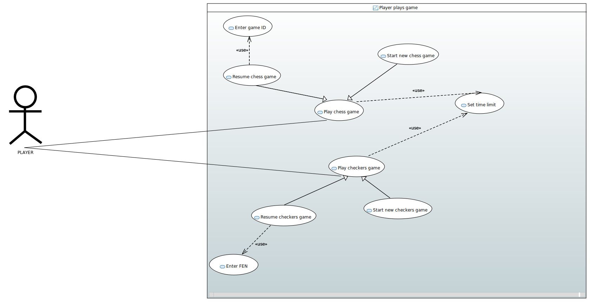

=== Documentation of scenarios for playing a game using a use case diagram

_This task consists of creation of a use case diagram specifying what choices a player has when he wants to play a game._

=== Explanation of the use case diagram:

This use case diagram aims to show which options a player can choose when he wants to play a game.
First option is to choose the game he wants to play : chess or checkers. This is done through either resuming a game (by entering the game ID in the case of a chess game or the fen in the case of a checkers game) or starting a new game.
For the both games, player must set time limit.

_You have below an image showing the use case diagram:_

