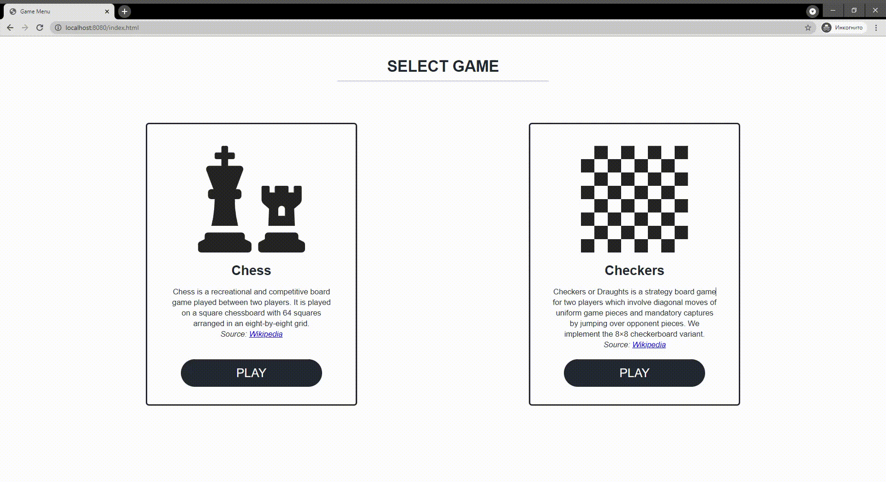

= Documentation for the displaying of a game clock.

Our goal was to display a remaining time for both player when they play Chess. For this purpose, new JavaScript function was added, which sends get requests to server each *10 seconds* to get the correct value of the remaining time (for both players). We could send a request every second in order to refresh the time more frequently, but it's probably not a good idea, since it would simply overload the server.

Obtained response from the server is parsed to obtain *hours*, *minutes* and *seconds*, so we could display it in a pretty format like this *00:00:00*, instead of just displaying the original value which server returns, e.g.: *PT30M*, it's done for convenience of players.

Additional *HTML* elements and *styles* were added to display the remaining time, which JavaScript code interacts with.

= Changing the default clock duration

After displaying the remaining time for white and black players, more functionalites were added for letting the players change the default clock, since it's essential to give players such kind of possibility, because the duration of a *casual* chess game differes a *LOT* from the duration of a *competitive* chess game.

For this, additional *Java* method named *setClockDuration* was implemented which responds to *POST* requests, uses the request parameter to change the default clock duration by calling *GameEntity's* *setClockDuration* method.

The value of this parameter is obtain from a *player* after they enter it into the *input* field and hit the *confirm* button. Worth noting that the button by default is disabled until player click *New game* or *Load game* button, since the *method* needs to know the *id* of the game.

Also, players only have *30* seconds to change the default clock duration after starting a new game to prevent game abuses and cheating, after that the default value would be kept. If the player changes clock duration, new value would be displayed and confirmation *button* with an input *field* get disabled.

Demonstration:

= Source

Resources which were used during the implementation:

JavaScript GET Request:: https://stackoverflow.com/questions/247483/http-get-request-in-javascript
JavaScript POST Request:: https://stackoverflow.com/questions/9713058/send-post-data-using-xmlhttprequest
