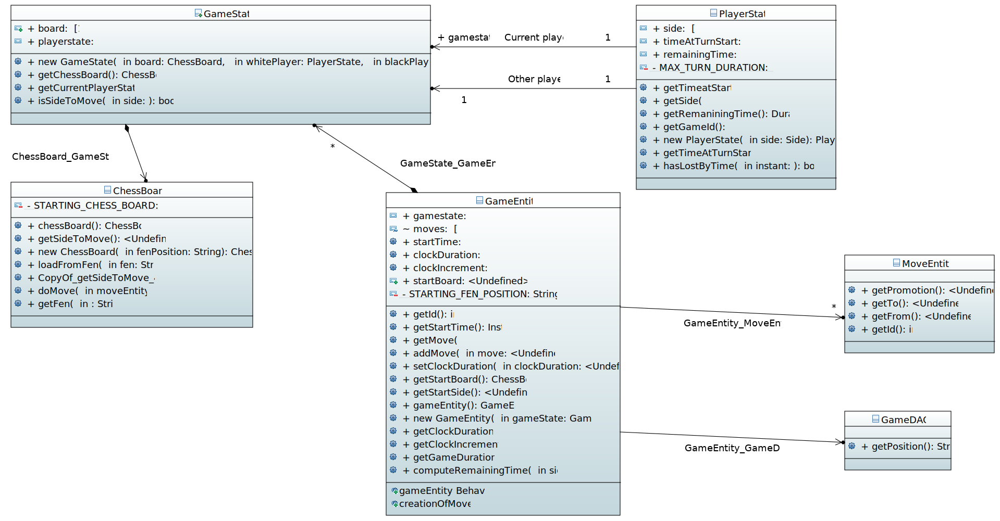

= Documentation

== Original description
Based on an idea generously provided by Vincent Giroux (thanks to him!)

The https://boardgamegeek.com/image/1648160/game-thrones-board-game-second-edition[board] https://boardgamegeek.com/wiki/page/Welcome_to_BoardGameGeek[game] essentially comes in two versions: on site, without a computer, or https://www.yucata.de/en[purely] https://fr.boardgamearena.com/[online]. In the first case, people gather and play around a board and physically embodied game elements. In the second case, people usually play at home.

The Assisted Board Game concept proposes to combine the advantages of both aspects. (For its detractors: the disadvantages of both aspects.) It is about sharing a moment together, being physically together, but with the help of a computer implementation. This will be particularly welcome for games requiring a https://boardgamegeek.com/image/2836495/republic-rome[lot] of manipulation of pieces and adjustments without decisions, or a https://boardgamegeek.com/image/1822915/zombie-15[long] set-up, but also to save the game, to replay an existing game, or to be assisted in various ways by a computer.

An Assisted Board Game is ideally composed of https://novotelstore.com/fr/table-interactive-play#prettyPhoto[an] https://www.theguardian.com/games/2018/mar/14/playtable-tablet-blockchain-technology-enhance-board-games-blokparty[interactive] https://d2rormqr1qwzpz.cloudfront.net/photos/2012/03/16/55-32402-11672_pax_catan_3_super.jpg[table], which acts as the game board, and one tablet per player. (For this project we will be satisfied with one computer acting as the interactive table and one computer per player).

The aim of this project is to build a generic system that can easily implement a wide range of games. We will start from an existing https://github.com/oliviercailloux-org/projet-assisted-board-games-1/blob/ABG-DocTranslate/Doc/README.adoc[project], which has implemented a system for playing chess. The aim will be to extend the functionalities to improve this chess game, but above all to generalise the logic to allow the inclusion of other games, initially similar (checkers...) then more distinct (poker...). The system will only allow the generation of the game engine, the ambition does not extend to the automatic generation of the graphical interface which will have to be programmed manually for each game.

The existing project allows to display the chess board; to play a move; to count the remaining time; it integrates a logic of saving and restoring a game and recovering a historical game, puzzles...

== The server
description 

- https://github.com/oliviercailloux-org/projet-assisted-board-games-1/blob/main/Doc/Server%20Implementation.adoc[How the server works]
- https://github.com/oliviercailloux-org/projet-assisted-board-games-1/blob/main/Doc/Heroku.adoc[Set up a server on Heroku]
- https://github.com/oliviercailloux-org/projet-assisted-board-games-1/blob/main/Doc/Curl-Documentation.adoc[Testing your server]
 
== The functional process of the assisted board games
description

 - https://github.com/oliviercailloux-org/projet-assisted-board-games-1/blob/main/Doc/PlayerState%20sequence%20diagram%20documentation.adoc[The overall application course]
 - https://github.com/oliviercailloux-org/projet-assisted-board-games-1/blob/main/Doc/Diagrams/GameManagement.svg[Game Management Class Diagram]
 - https://github.com/oliviercailloux-org/projet-assisted-board-games-1/blob/main/Doc/Game%20clock%20documentation.adoc[Game clock]
 - //le diagramme de séquement UML-tache41

== The mechanics of the games
 - https://github.com/oliviercailloux-org/projet-assisted-board-games-1/blob/ABG-Tache33/Doc/Chess_basics.adoc#play-chess-diagram[Play chess]
 - https://github.com/oliviercailloux-org/projet-assisted-board-games-1/blob/ABG-Tache33/Doc/Chess_basics.adoc#record-chess-move-diagram[Record Chess Move]
 - descriptions des deplacements/actions possibles 
 
== The user interface
 - https://github.com/oliviercailloux-org/projet-assisted-board-games-1/blob/ABG-Tache33/Doc/Chess_basics.adoc#record-chess-move-graphically-diagram[Record Chess Move Graphically]
 - comment instancier un plateau, joueur, piece ..)
  --> checkboard 
  --> Record Chess Move Diagram:
 - descriptions des deplacements/actions possibles 
 
* https://github.com/oliviercailloux-org/projet-assisted-board-games-1/blob/main/Doc/CheckerBoard%20documentation.adoc[Checkerboard Documentation] with the corresponding https://github.com/oliviercailloux-org/projet-assisted-board-games-1/blob/main/Doc/CheckerBoard%20class%20diagram%20documentation.adoc[class diagram documentation]

* https://github.com/oliviercailloux-org/projet-assisted-board-games-1/blob/main/Doc/Game%20clock%20documentation.adoc[Game clock documentation]

* https://github.com/oliviercailloux-org/projet-assisted-board-games-1/blob/main/Doc/Game_player_management_Documentation.adoc[Game and Player documentation]

* https://github.com/oliviercailloux-org/projet-assisted-board-games-1/blob/main/Doc/Move%20documentation.adoc[Move documentation]

* https://github.com/oliviercailloux-org/projet-assisted-board-games-1/blob/main/Doc/PlayerPlaysGame%20documentation.adoc[PlayerPLaysGames documentation]

* https://github.com/oliviercailloux-org/projet-assisted-board-games-1/blob/main/Doc/PlayerState%20sequence%20diagram%20documentation.adoc[PlayerState sequence diagram documentation]

* https://github.com/oliviercailloux-org/projet-assisted-board-games-1/blob/main/Doc/chessboard-js-README.md[chessboard-js-README.md]

* https://github.com/oliviercailloux-org/projet-assisted-board-games-1/blob/main/Doc/Heroku.adoc[documentation Heroku]

* https://github.com/oliviercailloux-org/projet-assisted-board-games-1/blob/main/Doc/Curl-Documentation.adoc[documentation Curl]

Our goal was to create the interface of the checkers game. The user can access the game from the menu by clicking the Play button of the checkers game.

After pressing this button, it will redirect the user to the selected game. He can start a new game or continue an existing one by using his https://en.wikipedia.org/wiki/Portable_Draughts_Notation[Portable Draughts Notaton] (PDN).
We also made sure to respect a similar layout to the chess game in terms of colors and available buttons. The goal is to have a coherent environment through the different games.

The interface of the checkers game was made using HTML, CSS, Javascript.

It is interesting to know that it is not possible to load a game if no PDN has been entered.
There is now a "Quit" button to return to the Main Menu.
We also display in real time the player who has to play (Black or White).
There is also a move suggestion useful for the novices to know the possible moves of a piece in the game

Screenshot 1:

image::Image/interface_quit.png[]

See: https://github.com/oliviercailloux/Assisted-Board-Games/blob/master/Doc/TODO.adoc[TODO’s].

=== Game Management Class Diagram:

Complete documentation is https://github.com/oliviercailloux-org/projet-assisted-board-games-1/blob/main/Doc/GameManagement_Documentation.adoc[here].

This diagram show the interactions of the different classes of a game of chess between 2 players.

It represents an overall game: The initialisation, the piece's movement, the in-game clock  and how the game is displayed on the chess board.

* `GameEntity` : The GameEntity class initializes the game of chess by setting up a clock for each player. It allows to define a time constraint for a game. 

*  `PlayerState` : manages all the information about the remaining time of the player, if he lost because he exceeded the time limit, his side (white or black).

* `GameState` : manages all the information about the state of the game at a given time. It manages the state of the board, i.e. how each piece is placed on the board. The class contains two `PlayerState` (one whose turn it is to play and one whose turn it is not).

* `ChessBoard` : create the chess board with all the pieces loaded.

* `MoveEntity` : manage the moves of the pieces on the board.

* `GameDAO` : get the position of a piece on the board. 

== How the server works
We use the https://gayerie.dev/udev-javaee/javaee_web/jaxrs.html[JAX-RS] API which allows to implement applications based on the https://developer.mozilla.org/fr/docs/Web/HTTP[HTTP] protocol (but not only).

We have implemented the class `MyApplication.java` which inherits from the class https://docs.oracle.com/javaee/7/api/javax/ws/rs/core/Application.html[`Application.java`]. We use the `@ApplicationPath('/v0')` annotation to give the URI pattern managed by JAX-RS. This class is the entry point of our application.
The server starts on port 8080 (locally). By navigating to http://localhost:8080/v0 it will render the `index.js` file which is located in `/src/main/resources/META-INF/resources` and thus the JavaScript interface. The latter works by communicating with the server.

image::Diagrams/ClientServer.svg[]

When it receives a request at the address http://localhost:8080/v0/api/v1/game/…, for example, the server calls a method of the `GameResource` class (because it is annotated `@Path("api/v1/game")`). The method called depends on the sequence of the requested address and the verb of the request.
For example, a request to the address `api/v1/game/new` calls the method `createGame()` (because this method is annotated `@Path("new")`). Another example: a request to `api/v1/help` with the `GET` verb calls the `suggestMove` method (annotated `@GET` of the `HelpResource` class
(annotated  `api/v1/help`).  You can refer to this https://github.com/oliviercailloux-org/projet-assisted-board-games-1/blob/main/Doc/Game_player_management_Documentation.adoc[Documentation] 

These methods usually call an `EntityManager` (part of a Java standard, Java Persistence API)
which takes care of placing the objects in the server's database or retrieving them.

== References
* https://dominion.games/
* https://boardgamearena.com/
* https://simmer.io/upload
* http://www.vassalengine.org/ : « Once we've released 3.3.0, I'll be focusing my efforts on assembling and updating all of that so we can get moving on V4. », http://www.vassalengine.org/forum/viewtopic.php?f=5&t=10027#p58941[29 mars 2020] http://www.vassalengine.org/forum/viewtopic.php?f=5&t=11195[Test builds for 3.3.0]. http://www.vassalengine.org/forum/viewtopic.php?f=5&t=3914[Roadmap for VASSAL 4] (2011) (The post about protobuf could be of interest.)
* https://chess.stackexchange.com/a/33584[Visual chess moves]
* https://github.com/tdf/odftoolkit/raw/master/src/site/site/content/odftoolkit_website/docs/presentations/2019%20-%20ACM%20DocEng%20-%20The_Next_Millennium_Document_Format_DRAFT_20190712.pdf, Svante Schubert. We should exchange patches (Operational Transformations, OT) and view a document as a list of changes, or a tree of changes. We should allow for more efficient standardization by means of supporting software tools.
