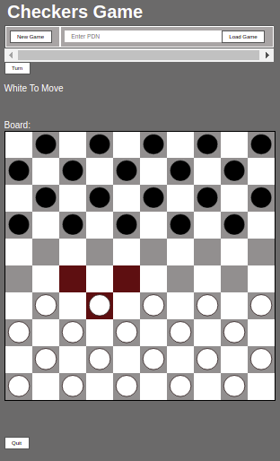

= Documentation

Our goal was to create the interface of the checkers game. The user can access the game from the menu by clicking the Play button of the checkers game. 

After pressing this button, it will redirect the user to the selected game. He can start a new game or continue an existing one by using his https://en.wikipedia.org/wiki/Portable_Draughts_Notation[Portable Draughts Notaton] (PDN). 
We also made sure to respect a similar layout to the chess game in terms of colors and available buttons. The goal is to have a coherent environment through the different games. 

The interface of the checkers game was made using HTML, CSS, Javascript. 

It is interesting to know that it is not possible to load a game if no PDN has been entered.  
There is now a "Quit" button to return to the Main Menu.
We also display in real time the player who has to play (Black or White). 
There is also a move suggestion useful for the novices to know the possible moves of a piece in the game

Screenshot 1:

See: https://github.com/oliviercailloux/Assisted-Board-Games/blob/master/Doc/TODO.adoc[TODO’s].

=== Play Chess Diagram:
Complete use case diagram is: https://github.com/oliviercailloux-org/projet-assisted-board-games-1/blob/ABG-2/Doc/Images/PlayerPlaysGame.SVG[here].

The use case diagram https://github.com/oliviercailloux-org/projet-assisted-board-games-1/blob/ABG-2/Doc/Diagrams/Play_chess.SVG[Play chess] contains two use cases `Play chess` and `Play new chess game` and an actor: the player. This use case will be our main focus at first, meaning that we will need to have a server to record the moves previously played.

=== Record Chess Move Graphically Diagram:

Complete Use Case Diagram: https://github.com/oliviercailloux-org/projet-assisted-board-games-1/blob/ABG-3-Amine/Doc/Diagrams/Record_chess_move_graphically.SVG[here]

The use case diagram Record Chess Move Graphically contains 2 actors, the player and the server. This Use Case describe the movement of a piece by the player.
When the player select a chess piece, it will display all the possible moves. Then, the player can change the piece position.
After the play, the recording of the new position by the server will be done. The server can also recover the moves.
This Use Case needs to be created first to be connected by the Use Case 1

=== Record Chess Move Diagram:

Complete Use Case Diagram: https://github.com/oliviercailloux-org/projet-assisted-board-games-1/blob/ABG-4-Final/Doc/Diagrams/Record_Chess_Move.SVG[here].

The Use Case Diagram Record Chess Move contains the two same actors mentioned above, linked to a Use Case Record Chess Move.
In this situation, the player have to play before the system records the chess move. After the system recorded the movement, it will update the position and recover the updates from the opposite player. We didn't add all the details in the Use Case Diagram because it was too heavy.
This Use Case will be our short term main focus.

== Original description (to be translated)
D’après une idée généreusement fournie par Vincent Giroux. (Merci à lui !)

Le https://boardgamegeek.com/wiki/page/Welcome_to_BoardGameGeek[jeu] de https://boardgamegeek.com/image/1648160/game-thrones-board-game-second-edition[plateau] se décline essentiellement en deux versions : sur place, sans ordinateur ; ou https://play.google.com/store/apps/details?id=com.f2zentertainment.pandemic[purement] http://www.yucata.de/[en] https://boardgamearena.com/[ligne]. Dans le premier cas, on se réunit et on joue autour d’un plateau de jeu et d’éléments de jeu incarnés physiquement. Dans le deuxième cas, on joue généralement chacun chez soi.

Le concept d’Assisted Board Game propose de réunir les avantages des deux aspects. (Pour ses détracteurs : les inconvénients des deux aspects.) Il s’agit de partager un moment ensemble, en étant physiquement réunis, mais tout en profitant de l’aide d’une implémentation informatique. Ceci sera particulièrement bienvenu pour les jeux nécessitant de https://boardgamegeek.com/image/2836495/republic-rome[nombreuses] manipulations de pions et ajustements sans décisions, ou une https://boardgamegeek.com/image/1822915/zombie-15[longue] mise en place, mais aussi pour sauvegarder la partie, rejouer une partie existante, ou se faire assister de diverses manières par un ordinateur.

Un Assisted Board Game est composé, idéalement, d’link:https://novotelstore.com/fr/table-interactive-play#prettyPhoto%5Bmedia_gallery%5D/1/[une] https://d2rormqr1qwzpz.cloudfront.net/photos/2012/03/16/55-32402-11672_pax_catan_3_super.jpg[table] https://www.theguardian.com/games/2018/mar/14/playtable-tablet-blockchain-technology-enhance-board-games-blokparty[interactive], qui joue le rôle de plateau de jeu, et d’une tablette par joueur. (Pour ce projet on se contentera d’un ordinateur qui jouera le rôle de table interactive et d’un ordinateur par joueur.)

Ce projet vise à construire un système générique permettant facilement d’implémenter une vaste gamme de jeux. On repartira d’un https://github.com/oliviercailloux/Assisted-Board-Games[projet] existant, qui a implémenté un système permettant de jouer aux échecs. Il s’agira pour partie d’étendre les fonctionnalités pour améliorer ce jeu d’échecs, mais surtout de généraliser la logique pour permettre l’inclusion d’autres jeux, d’abord similaires (dames…) puis plus distincts (poker…). Le système permettra seulement de générer le moteur du jeu, l’ambition ne s’étendant pas à la génération automatique d’interface graphique qui devra donc être programmée manuellement pour chaque jeu.

Le projet existant permet d’afficher le plateau de jeu d’échecs ; de jouer un coup ; de décompter le temps restant ; il intègre une logique de sauvegarde et restauration de partie et de récupération d’une partie historique, des puzzles… 

== Original documentation (to be translated)
Le programme lance un serveur. En navigant vers `http://localhost:8080`, l’interface en Javascript s’active.

L’interface fonctionne en communiquant avec le serveur en question. Lorsqu’il reçoit une requête à l’adresse `http://localhost:8080/api/v1/game/…`, le serveur appelle une méthode de la classe `GameResource` (car elle est annotée `@Path("api/v1/game")`). La méthode appelée dépend de la suite de l’adresse requêtée. Par exemple, une requête à l’adresse `api/v1/game/new` appelle la méthode `createGame()` (car cette méthode est annotée `@Path("new")`). Ces méthodes appellent généralement un `EntityManager` (partie d’un standard Java, Java Persistence API) qui s’occupe de placer les objets dans la base de données du serveur ou de les en récupérer.

Quand une requête est envoyée à l’adresse `api/v1/game/import`, c’est la méthode `importGame(GameDAO)` qui est appelée. La requête est censée contenir des données au format JSON, qui sont automatiquement transformées par le serveur en un objet de type `GameDAO` et passées en paramètre de la méthode.

== References
* https://dominion.games/
* https://boardgamearena.com/
* https://simmer.io/upload
* http://www.vassalengine.org/ : « Once we've released 3.3.0, I'll be focusing my efforts on assembling and updating all of that so we can get moving on V4. », http://www.vassalengine.org/forum/viewtopic.php?f=5&t=10027#p58941[29 mars 2020] http://www.vassalengine.org/forum/viewtopic.php?f=5&t=11195[Test builds for 3.3.0]. http://www.vassalengine.org/forum/viewtopic.php?f=5&t=3914[Roadmap for VASSAL 4] (2011) (The post about protobuf could be of interest.)
* https://chess.stackexchange.com/a/33584[Visual chess moves]
* https://github.com/tdf/odftoolkit/raw/master/src/site/site/content/odftoolkit_website/docs/presentations/2019%20-%20ACM%20DocEng%20-%20The_Next_Millennium_Document_Format_DRAFT_20190712.pdf, Svante Schubert. We should exchange patches (Operational Transformations, OT) and view a document as a list of changes, or a tree of changes. We should allow for more efficient standardization by means of supporting software tools.

