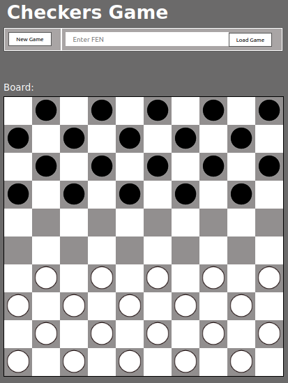
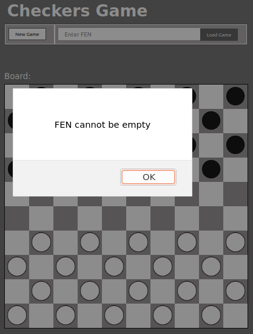
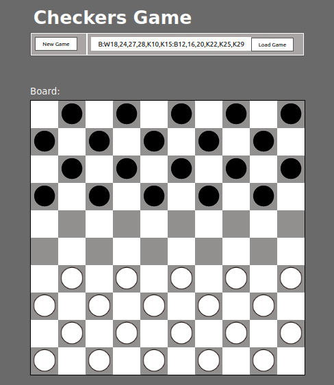

= Documentation of the checkers game creation

Our goal was to create the interface of the checkers game. The user can now access the game from the menu by clicking the Play button of the checkers game. 

After pressing this button, it will redirect the user to the selected game. He can start a new game or continue an existing one by using his FEN tag (link). 
We also made sure to respect a similar layout to the chess game in terms of colors and available buttons. The goal is to have a coherent environment through the different games. 

The interface of the checkers game was made using HTML, CSS, Javascript. 

It is interesting to know that it is not possible to load a game if no FEN has been entered.  

Screenshot 1:

Screenshot 2:

Checkers Game interaction:

Docs which were used during the implementation:

*Load games from FEN* : https://stackoverflow.com/questions/11563638/how-do-i-get-the-value-of-text-input-field-using-javascript

*Checkers basics* : https://github.com/aurelien-naldi/jsboard

