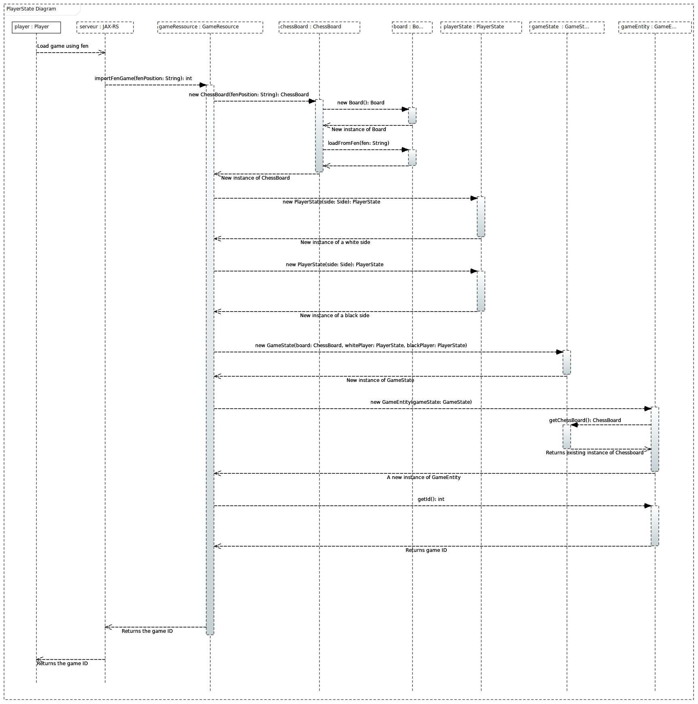

= Documentation for the PlayerState class, enriching existing documentation

_Our goal was to improve the existing documentation with adding the documentation of PlayerState class. In the sequence diagram we tried to illustrate how the application uses `PlayerState` class and exactly when._ 

When the player loads a game using FEN notation, the server calls `importFenGame` method in the `GameResource` class, passing it as an argument the `FEN` notation provided by the player. 

Then, inside this method `GameResource` class proceeds to creating a new instance of a `ChessBoard` (by invoking it's constructor) class passing it as an argument `FEN` string. Inside it's constructor ChessBoard class, creates a new instance of a `Board` class (third party chess game library) and then uses this instance to call it's method loadFromFen, passes as an argument to this method `FEN` string. After that, the new instance of a `ChessBoard` is returned to GameResource.

The next step is a creation of two instance of PlayerState object (one for a white player and another one for black player) by invoking it's constructor. After all, the method proceeds to creating a new instance of a `GameState` object by passing in it's constructor an instance of a `ChessBoard` and two instances of a PlayerState, all of which method created earlier. 

The returned instance of a `GameState` object is passed as an argument to the constructor of `GameEntity`. Inside of it GameEntity class uses provided instance of a GameState to get the existing ChessBoard and uses it to initialize it's instance variable `startBoard`. After that, a new instance of a GameEntity is returned.

At the end, the `importFenGame` method is called with `getId` as parameter and return an instance of GameEntity. This will return the id of the game to the GameRessource class, and in the same way to the player.

You can find all the informations concerning our diagram in this https://github.com/oliviercailloux-org/projet-assisted-board-games-1/tree/Documentation-PlayerState-UML/Doc/Papyrus[folder].

Sequence diagram:

